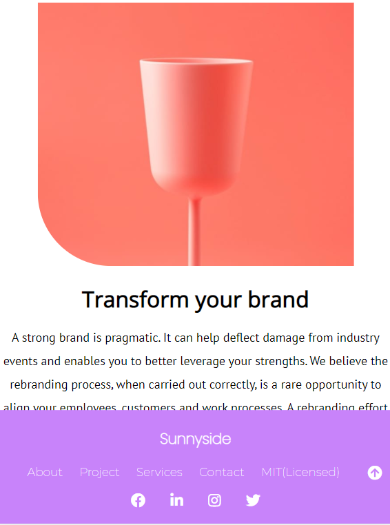
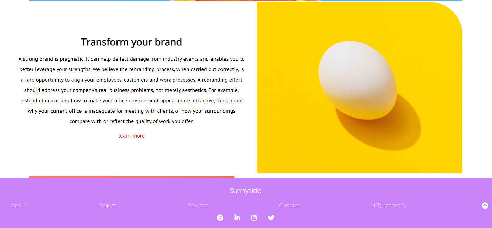
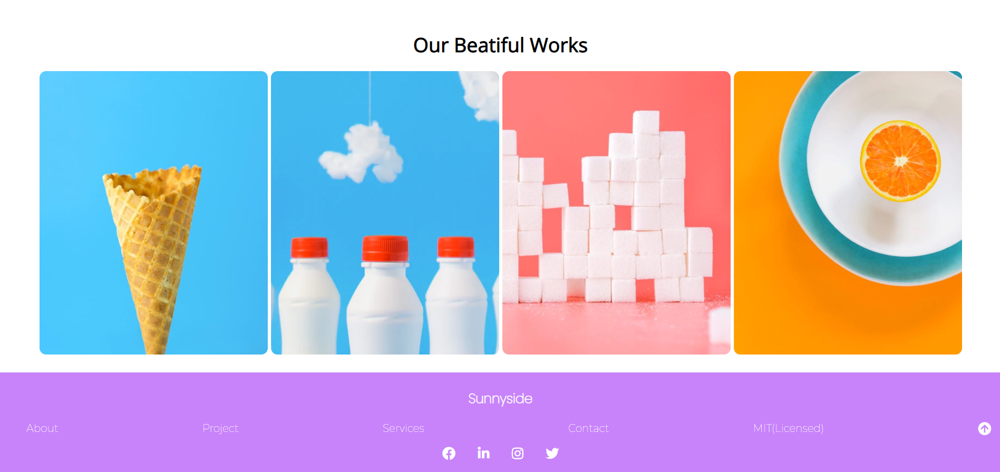
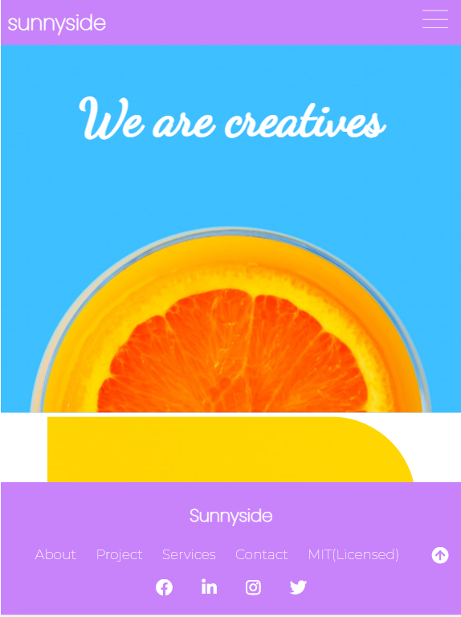
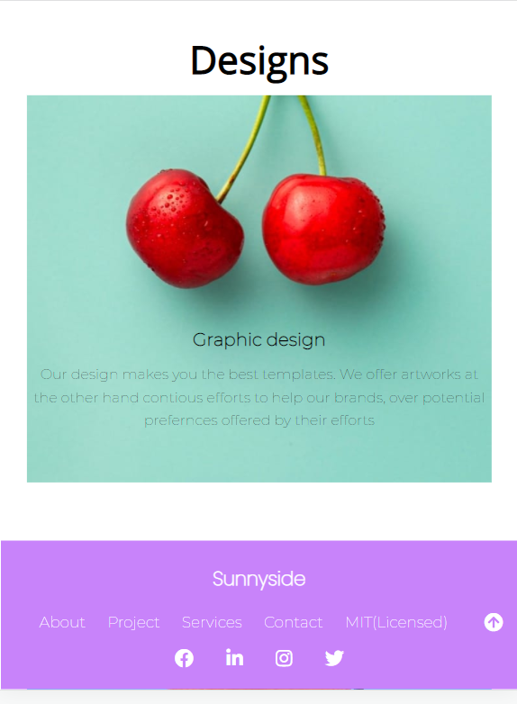
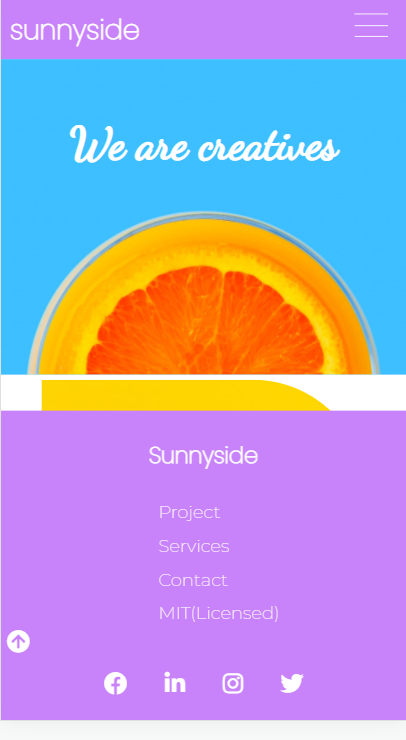
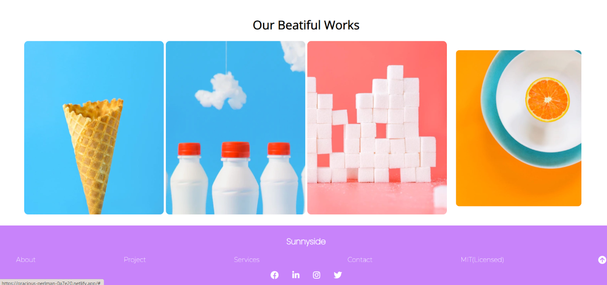
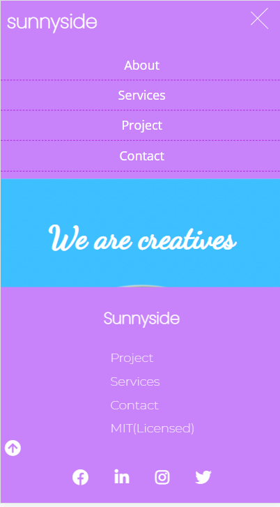

 # Front-end Project

 ## Welcome!

 ##let's get started.

 Thank you for checking this work.

 ## About This Work:
   This is a Portfolio website, which is showcasing different types of design and passion for decorating different works, anywhere around. Firstly this beautigul work is for practsing on understanding and broadening of building and designing a beautiful website with good UI's.

## pictures of this Work

 ##process##
 
      THIS FILE IS FOR THE PRACTISE OF HTML(DEEPER)
      
 -PRACTISE FOR THE BUILDING OF MODERN SEMANTIC WEBSITE
 
 -STRUCTURES OF DIFFERENT , AND PROPER DISPLAY OF MARKUP'S IN A CONTAINER.
 
 -PRACTISED PROPER INTERNAL LINKING OF PAGES WITHIN A CONTAINER.

    THIS FILE IS FOR THE PRACTISE OF CSS
 -PRACTISED USING GRIDS TO YIELD OUT A BEAUTIFUL LAYOUT OF DIFFERENT SECTIONS.
 
 -USED FLEXBOX TO CONTROL THE DISPLAY PATTERN.
 
 -USED THE POSITION PROPERTY IN ENSURING  SMOOTH AND LAYOUT AND CHECKPOINTS.
 
 -IT'S ALSO VERY RESPONSVE.see.....

 ## Larger screen sizes

 ## smaller screen sizes

##worked on an animation section##
-CSS TRANSFORM: Super useful syntax used to animate elements for little interaction

  ## Built with         
      -HTML(Hypertext Mark-up Language)
      -CSS(Cascading Styles Sheet)
      -JS(Java-Script)

  ## My Challanges and lessons
   Learnt how to re-size pictures with percentages firstly, used my fontsizes well, my nav-bar saga, which was quite taskful at the beginning with, and also the entire structure of  the Webpage. It was intersting, and i came up with this nav-section for mobile view:

   

   ## Installations
   -For those Farmiliar with Git-hub you can clone the repo and pull to your local workplace to view.
   -For those who ant to view you can download the file from here [https://gracious-perlman-0a7e20.netlify.app/], to view Thank you once again.

   ## Best syntax Used

    ``CSS
   (transform), (flex-box), and (power of proper font usage).
  Transform is very important for efficient animations to improver the ui's of a website, with the flex-box to avoid dis-mantle of sections and our all underrated font usage.
   ``

   ## Resources that helped ##
   -For the Colors[https://htmlcolorcodes.com/color-names/]
   -For the icons[https://fontawesome.com/v5.15/icons/instagram?style=brands] and svg's in the folder.

 ## Licsense 
   This work is under [MIT] liscence. It's highly free and opensource to anyone.

    This is an open source project from [DevProjects](http://www.frontend.io/challenges). Feedbacks are welcomed, thank you so much.
